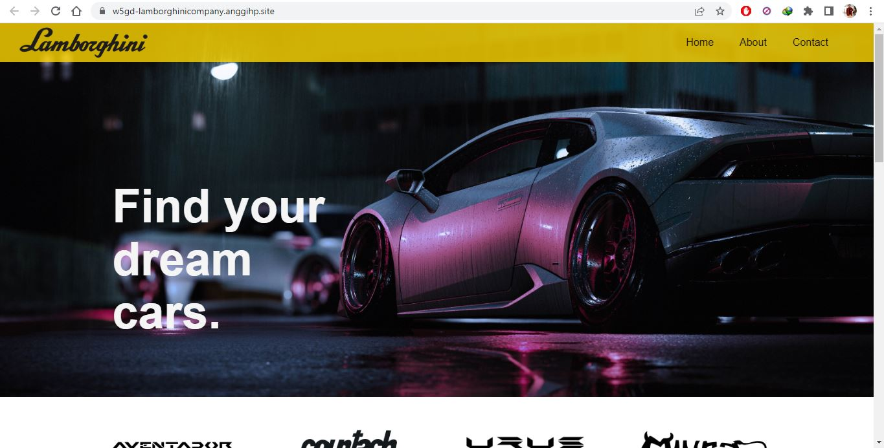

# Week 5 Assignment - Group Project - Lamborghini Company

This is our work on Group Project as assignment of Week 5
FSSE Madrid 2023

## Team members:

- Immanuel Arya
- Anggih Pratama

## Links/URLs:

- Website: [w5gd-lamborghinicompany.anggihp.site](http://w5gd-lamborghinicompany.anggihp.site/)

- Website on Netlify Deployment: [w5-groupd-lamborghini-anggihp.netlify.app](https://w5-groupd-lamborghini-anggihp.netlify.app/)

- Wireframe on Miro: [W5-GroupProject-groupd-wireframe](https://miro.com/app/board/uXjVPpQ9OSU=/)

- MockUp on Figma: [W5-GroupProject-groupd-MockUp&Prototyping](https://www.figma.com/file/MzVVRCsUrWzau8hmM8px8W/W5-GroupProject-groupd-MockUp%26Prototyping)

- Prototyping on Figma: [W5-GroupProject-groupd-MockUp&Prototyping](https://www.figma.com/proto/MzVVRCsUrWzau8hmM8px8W/W5-GroupProject-groupd-MockUp%26Prototyping)

## Pages:

- Home
- About
- Contact

## Color:

- White
- Black
- Gold

## My Website Project Preview

1. Home Page

